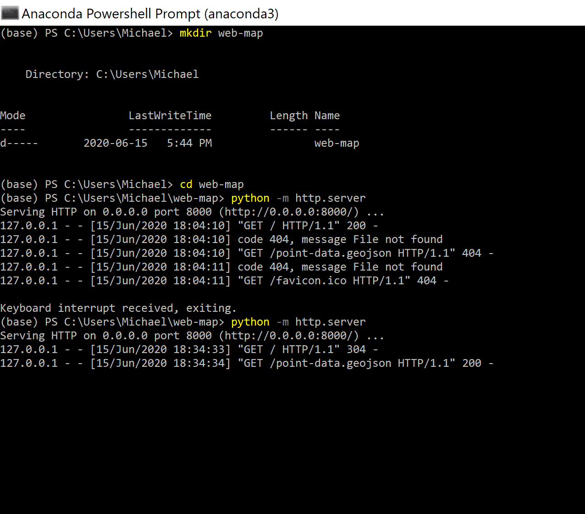
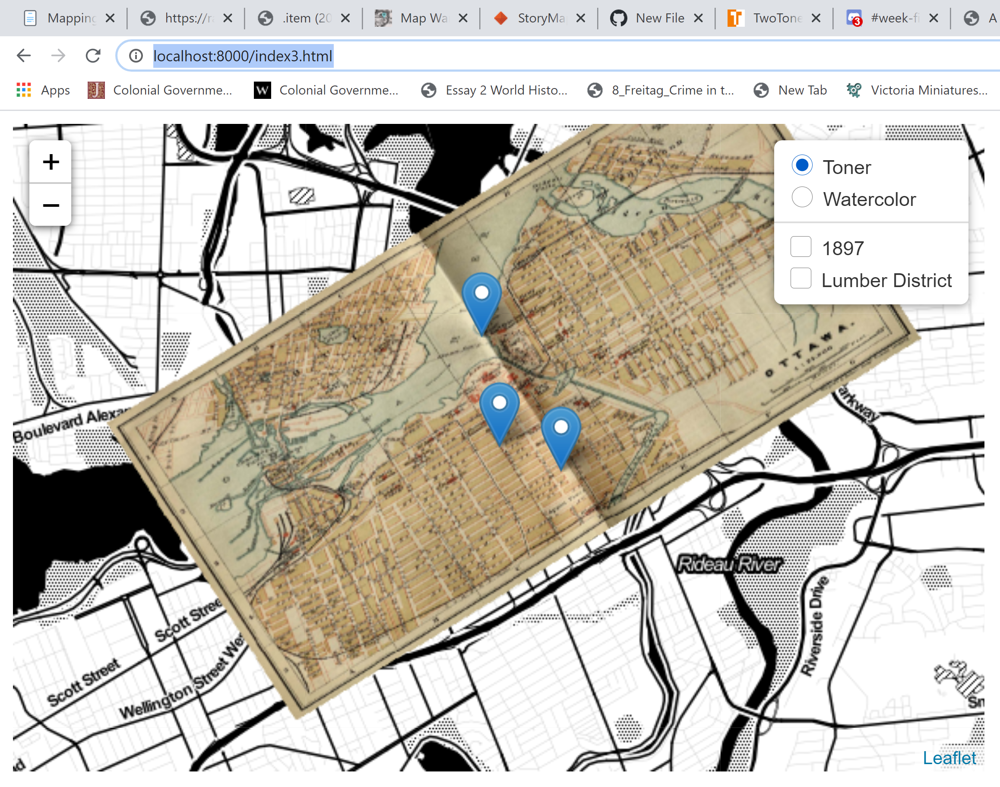
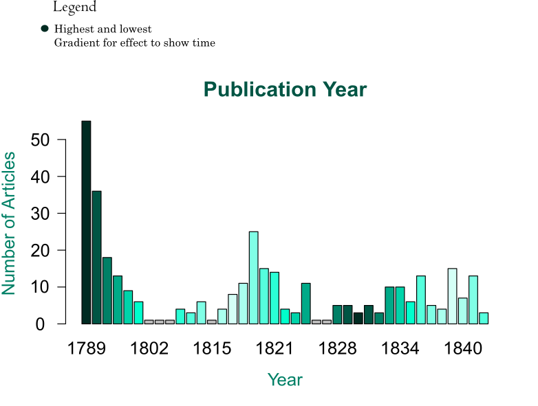
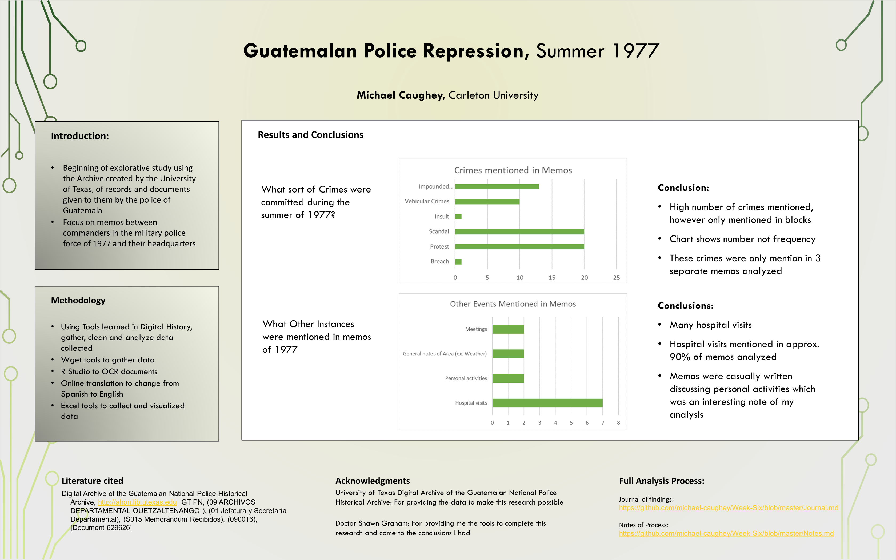

Our first task this week is to make a podcast. Now I have severe perfomance anxiety so I had my fiancee record the short podcast based off a script I wrote for her and I then edited it and cleaned it up. The Sound bite is in the repo for this week. I understand that due to the time constraints I put on myself by not staying on top of the course work I may not be able to have it all edited and prettied up by professor Graham but it was definitely a great experience and it has sparked my fiance to attempt to start her own podcast!

The second task this week was to look at sonification. I chose to use the data set provided to us again for times sake as the csv file I found on the subject matter I wanted to use needed severe cleaning up. Whoever formats the files in the government of canada needs to take this course because to an untrained eye it is mumbo jumbo up in there!

With the roman data I used a Harp sound and an ocillator sound to potray my data as I feel like they kind of mimic the sound of money with the limited instrument choices in this app. I changed up the octaves each sound wave. The coin data I changed to be able to move 2 octaves as money has more value than other objects and the other roman materials may have cost less. The way the sounds oull apat from each other is very interesting as you can hear that certain areas had more coin and some had more. 

I think with sonification there is a place for it. It definitely would not be an accurate representation of data for certain things and many people don't understand the value certain aspects of music have. I feel this app also is bare bones of a music editing app and there are things I would have liked to do to make it a little nicer on the ear but over all I think for data comparisons and making data more approachable to people this is a good tool. I definitely think this could be used in different ways, such as comparing numbers in different army regimens You could give the "bad guys" a deeper, sound and give the "good guys" a happier sound while also changing the volume throughout to signify who is winning. The capabilities in this app are not that advanced but I know that there are ways of doing it and I am interested to see what others have done with all of the technology availible to the music community.

After that I moved onto mapping, I began with StoryMaps. I chose to use my journey to becoming a historian as my topic to keep it simple, I know in the description they suggest using a topic that leads to big occourances and I feel as though there are major events in my life that influenced my journey. 
<iframe src="https://uploads.knightlab.com/storymapjs/56da74fe7d95876bc82ebb9f9b1b85d6/the-journey-to-becoming-a-historian/index.html" frameborder="0" width="100%" height="800"></iframe>

I next went of to web mapping. I opened Anaconda Command Prompt and created a new directory `mkdir web-map`

I then created a sublime text file and copied the code from our week 5 page and named it index.html
```
<head>

	<title>A Demo WebMap</title>

	<meta charset="utf-8" />
	<meta name="viewport" content="width=device-width, initial-scale=1.0">

	<link rel="stylesheet" href="https://unpkg.com/leaflet@1.6.0/dist/leaflet.css" />
	<script src="https://unpkg.com/leaflet@1.6.0/dist/leaflet.js"></script>
    <script src="https://ajax.googleapis.com/ajax/libs/jquery/1.11.1/jquery.min.js"></script>
    <script type="text/javascript"></script>
    </script>

</head>
```
I then saved the leaflet files into my geo-map file

Then I copied the other portion of the code into the .html file
```
<body>
<div id="mapid" style="width: 600px; height: 400px;"></div>
<script type="text/javascript">
var myMap = L.map('mapid').setView([45.4192857, -75.6973237],13);
L.tileLayer('https://stamen-tiles-{s}.a.ssl.fastly.net/toner/{z}/{x}/{y}.png',
	{maxZoom: 19
}).addTo(myMap);
```
I then copied the next portion of the code into a new file named point-data.geojson
```
{
   "type": "FeatureCollection",
   "features": [
  {
    "type": "Feature",
    "geometry": {
       "type": "Point",
       "coordinates":  [-75.6973237, 45.4192857]
    },
    "properties": {
    "Label":"Centre of our map!"
    }
  },
  {
    "type": "Feature",
    "geometry": {
       "type": "Point",
       "coordinates":  [ -75.699222, 45.4275 ]
    },
    "properties": {
    "Label":"Not the centre of the map "
    }
  }
]
}
```
I then appended the following into my .html file: 
```
// load a GeoJSON from external file
$.getJSON("point-data.geojson", function(data) {
  // add GeoJSON layer to the map once the file is loaded
  var datalayer = L.geoJson(data ,{
  onEachFeature: function(feature, featureLayer) {
  featureLayer.bindPopup(feature.properties.Label);
  }
}).addTo(myMap);
});

</script>

</body>
</html>
```
and saved!

I did have an issue saving the .geojson file. I could not figure out how to not save it into a geojson file it kept saving as that with .html at the end of the file. I am going to try and see if anyone else had an issue.

No one else seemed to have the same issue but I did see a suggestion to fix the next issue I had. 

I opened command prompt again and used the command `python -m http.server` and got a web address. When I copied and pasted it gave me an error: 'site can't be reached' and Keiran H suggested we use http://localhost:8000/ instead of http://0.0.0.0:8000/ which is the url command prompt had given me. Once I used the other URL I did access my WebMap!

I also went into my file explorer and renamed my .geojson from there getting rid of the .html and that succesfull changed in into a .geojson file. Once my command prompt finishes running I will try to rerun the command and see if I get a different result. Below is the errors I recieved when I ran the code the first time as well as the results from the second time I ran the code:



Also becuase I am still unsure of the proper way to embed the file into my repo I ave chosed to simply add in a screenshot. This is also for the sake of time as I created an extreme deadline for myself by not staying on top of my work and I am simply being realistic.


Once poweshell finished running the rerun command I moved on to the next portion of mapping. I added another layer following the instructions provided to us. Beginning with reopening the index.html sublime file. I then added a next line of code:
```
L.tileLayer('http://mapwarper.net/maps/tile/29435/{z}/{x}/{y}.png',
  {maxZoom: 19}
).addTo(myMap);
```
3 empty lines after the last semicolon of our base layer command

I then save and refreshed the page I had open with my web map which ended up looking like this:


I then moved on to Georectifying a map. I chose to use the map given to us in the instructions for this week. I signed up for the georectifying web app and waited almost 2 hours to recieve an email confirmation to allow me to access the webpage. I will continue to wait while I move on to the next portion of the mapping which is adding a layer control button.

I began by copying my index.html file to create index2.html. I then deleted the code we had in there between `var myMap =` and `// load a GeoJSON from external file`. I then copied in the next few sections of code to create variabes, tell leaflet what the center of the map was as well as create the control box:
```
var toner = L.tileLayer('https://stamen-tiles-{s}.a.ssl.fastly.net/toner/{z}/{x}/{y}.png'),
  watercolor = L.tileLayer('https://stamen-tiles-{s}.a.ssl.fastly.net/watercolor/{z}/{x}/{y}.png'),
  historical1897 = L.tileLayer('https://mapwarper.net/maps/tile/29435/{z}/{x}/{y}.png'),
  lumberdistrict = L.tileLayer('https://mapwarper.net/maps/tile/27671/{z}/{x}/{y}.png')

var baseMaps = {
  "Toner": toner,
  "Watercolor": watercolor
};

var overlayMaps = {
  "1897": historical1897,
  "Lumber District": lumberdistrict
}
// load a GeoJSON from external file
$.getJSON("point-data.geojson", function(data) {
  // add GeoJSON layer to the map once the file is loaded
  var datalayer = L.geoJson(data ,{
  onEachFeature: function(feature, featureLayer) {
  featureLayer.bindPopup(feature.properties.Label);
  }
}).addTo(myMap);
});

var myMap = L.map('mapid', {
  center: [45.4192857, -75.6973237],
  zoom: 13,
  layers:[toner]
});

L.control.layers(baseMaps, overlayMaps).addTo(myMap);
```
I then opened a new webpage and copied the following address to open my new wepmap: `http://localhost:8000/index2.html` and created a webmap that I a able to control variables in. 


I then moved on to add animation to my webmap.

I created a new Sublime text file and named it `Leaflet.AnimatedMarker.js` and saved it in my wep-map folder. I then copied and pasted the following code from Animated Marker Plugin 
```
L.AnimatedMarker = L.Marker.extend({
  options: {
    // meters
    distance: 200,
    // ms
    interval: 1000,
    // animate on add?
    autoStart: true,
    // callback onend
    onEnd: function(){},
    clickable: false
  },

  initialize: function (latlngs, options) {
    this.setLine(latlngs);
    L.Marker.prototype.initialize.call(this, latlngs[0], options);
  },

  // Breaks the line up into tiny chunks (see options) ONLY if CSS3 animations
  // are not supported.
  _chunk: function(latlngs) {
    var i,
        len = latlngs.length,
        chunkedLatLngs = [];

    for (i=1;i<len;i++) {
      var cur = latlngs[i-1],
          next = latlngs[i],
          dist = cur.distanceTo(next),
          factor = this.options.distance / dist,
          dLat = factor * (next.lat - cur.lat),
          dLng = factor * (next.lng - cur.lng);

      if (dist > this.options.distance) {
        while (dist > this.options.distance) {
          cur = new L.LatLng(cur.lat + dLat, cur.lng + dLng);
          dist = cur.distanceTo(next);
          chunkedLatLngs.push(cur);
        }
      } else {
        chunkedLatLngs.push(cur);
      }
    }
    chunkedLatLngs.push(latlngs[len-1]);

    return chunkedLatLngs;
  },

  onAdd: function (map) {
    L.Marker.prototype.onAdd.call(this, map);

    // Start animating when added to the map
    if (this.options.autoStart) {
      this.start();
    }
  },

  animate: function() {
    var self = this,
        len = this._latlngs.length,
        speed = this.options.interval;

    // Normalize the transition speed from vertex to vertex
    if (this._i < len && this._i > 0) {
      speed = this._latlngs[this._i-1].distanceTo(this._latlngs[this._i]) / this.options.distance * this.options.interval;
    }

    // Only if CSS3 transitions are supported
    if (L.DomUtil.TRANSITION) {
      if (this._icon) { this._icon.style[L.DomUtil.TRANSITION] = ('all ' + speed + 'ms linear'); }
      if (this._shadow) { this._shadow.style[L.DomUtil.TRANSITION] = 'all ' + speed + 'ms linear'; }
    }

    // Move to the next vertex
    this.setLatLng(this._latlngs[this._i]);
    this._i++;

    // Queue up the animation to the next next vertex
    this._tid = setTimeout(function(){
      if (self._i === len) {
        self.options.onEnd.apply(self, Array.prototype.slice.call(arguments));
      } else {
        self.animate();
      }
    }, speed);
  },

  // Start the animation
  start: function() {
    this.animate();
  },

  // Stop the animation in place
  stop: function() {
    if (this._tid) {
      clearTimeout(this._tid);
    }
  },

  setLine: function(latlngs){
    if (L.DomUtil.TRANSITION) {
      // No need to to check up the line if we can animate using CSS3
      this._latlngs = latlngs;
    } else {
      // Chunk up the lines into options.distance bits
      this._latlngs = this._chunk(latlngs);
      this.options.distance = 10;
      this.options.interval = 30;
    }
    this._i = 0;
  }

});

L.animatedMarker = function (latlngs, options) {
  return new L.AnimatedMarker(latlngs, options);
};
```
I then copied my index file again creating index3.html. I opened it and added another line of code between `<head>` and `</head>` as an extra line underneath te list of script codes. The added code is as below:
```
<script src="Leaflet.AnimatedMarker.js"></script>
```
I then Added the following code after the `L.control.layers` line:
```
var line = L.polyline([[45.4245941,-75.6953823],[45.423299,-75.6927912],[45.4174419,-75.6907598]]),
    animatedMarker = L.animatedMarker(line.getLatLngs());
```
I then added the final line to create an animation path
```
myMap.addLayer(animatedMarker);
```
finally I went to the webpage to see the work I had done at `http://localhost:8000/index3.html` on my PC the final product looked like this after the pin moved



I finally got the confirmation email for Map Warper and I moved onto that portion of week 5. I began by uploading the map of parliment hill from our week 5 work and filled in the metadata and uploaded the image of the map. 

I then clicked Rectify and set 5 control points. I on wellington in front of Parliment hill, one at Metcalfe and Slater, one at York and King, and one at Rideau and Cobourg.

The final image I saw was this:


The web address to this is also listed below

`http://mapwarper.net/maps/tile/48221/{z}/{x}/{y}.png`

So with that part done I can now move onto 'posters'

I did the reading and am now going to spruce up the chart in Inkspace.

I had already downloaded and installed inkscape to make my poster for week 6 so I opened up inkscape. I looked at the .pdf and then uploaded into Inkscape. 

I messed around with the image and changed the colour of the bars and text as well as added a legend. Although I did not have a specific quesion I was trying to use this graph for it allowed me to figure out the functions of the tool at my disposal. I noticed the font I chose for my Legend did not translate well into .png form so that is definitely omething I will keep in mind when I use this tool again.



I then decided to skip the portion about the academic poster as I feel like I have a good grasp on how to utilize inkscape and I also had done an academic poster for our week 6 project. Again I had fallen behind so I did week 6 before week 5. I will insert an image of that below:



Moving on to the final part of week 5, we are looking at static websites. 

I am going to begin by creating a new repository in my github account called michael-caughey.github.io. I will then create a file called index.md

In that index I copied and pasted the short blurb Professor Graham put into out week 5 information
```
## My Quick Static Site

This is a site I build with gh-pages. **Wow**

It reads [markdown](https://www.markdownguide.org/) and turns it into html.


```
I then commited that file and clicked the cog. Scrolled down to Gitpages info, chose a theme. It added the html code into my repository and then I copied the [link to my new static website](https://michael-caughey.github.io/).

I didn't realize how easy it was to create a static webpage! Very cool!

Throughout this weeks work, athough I was working kind of fast through it all it was very rewarding to discover ways to put all of the data and research I can now collect and put together into a digestable format for those who may not be able to uderstand the back page work I can now do!
